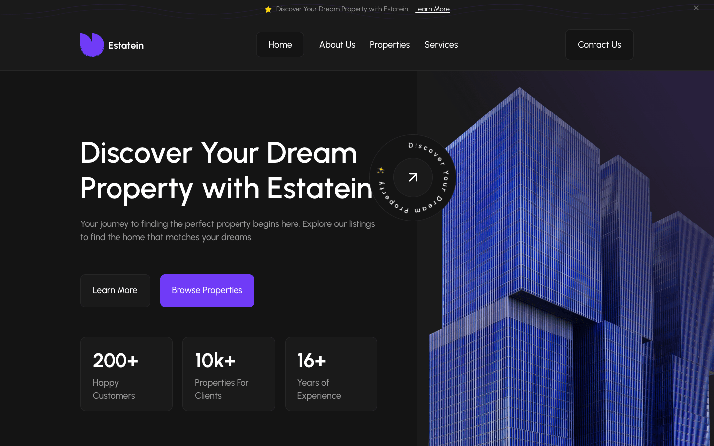
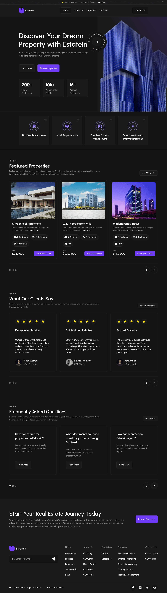

# Estatein — Real Estate WordPress Theme

> Pixel-perfect dark-themed WordPress theme matching the Estatein Figma design.
> Built for the Growmodo developer assessment.


## Table of Contents

- [Overview](#overview)
- [Demo](#demo)
- [Features](#features)
- [Tech Stack](#tech-stack)
- [Prerequisites](#prerequisites)
- [Installation](#installation)
- [Architecture Decisions](#architecture-decisions)
- [Theme Structure](#theme-structure)
- [Content & Data](#content--data)
- [Performance](#performance)
- [Accessibility](#accessibility)
- [Browser Support](#browser-support)
- [Author](#author)
- [License](#license)

## Overview

A custom dark-themed WordPress theme for the Estatein real estate brand. Single homepage with hero, features, properties, testimonials, FAQ, and CTA sections — all editable via Advanced Custom Fields. Vanilla CSS, no build tooling, runs entirely in Docker.

**Figma source:** [Real Estate Business Website — Dark Theme](https://www.figma.com/community/file/1314076616839640516)

## Demo



## Features

- Pixel-perfect Figma-to-code with responsive breakpoints (390 px / 1440 px / desktop)
- Dark theme tokens via CSS custom properties + fluid typography with `clamp()`
- Custom Post Type for property listings with ACF metadata
- Header banner dismiss, mobile nav toggle, newsletter subscribe, smooth scroll
- Vanilla JS only (no jQuery), single CSS file, semantic HTML5

## Tech Stack

| Layer    | Tool                              |
|----------|-----------------------------------|
| CMS      | WordPress 6.7                     |
| Runtime  | PHP 8.2                           |
| Database | MySQL 8.0                         |
| Styling  | Vanilla CSS + custom properties   |
| Content  | Advanced Custom Fields (free)     |
| Local    | Docker Compose                    |

## Prerequisites

- **Docker Desktop** — [Download](https://www.docker.com/products/docker-desktop/)
- **Git** — [Download](https://git-scm.com/downloads)

That's it. Everything else (WordPress, MySQL, PHP) runs in Docker containers.

## Installation

1. Clone and enter the repo:
   ```bash
   git clone <repo-url>
   cd growmodo
   ```

2. Copy the env file:
   ```bash
   cp .env.example .env
   ```

3. Start the stack:
   ```bash
   docker compose up -d
   ```
   First run pulls images (~600 MB). WordPress will be on **:8080**.

4. Visit <http://localhost:8080> and finish the WordPress installer:
   - Site Title: **Estatein**
   - Username: **admin**
   - Password: **admin** (or anything you'll remember)
   - Email: any address

5. In **wp-admin** (<http://localhost:8080/wp-admin>), go to **Appearance → Themes** and activate **Estatein**.

6. *(Recommended)* **Plugins → Add New** → search for **Advanced Custom Fields**, install + activate. The theme falls back to hardcoded defaults without it.

7. **Settings → Reading** → choose **A static page** → pick any page as the Homepage.

8. **Properties → Add New** → add ~3 sample listings (title, featured image, and ACF fields: price, bedrooms, bathrooms, type).

9. Refresh <http://localhost:8080>. Done.

To stop the stack:
```bash
docker compose down
```

## Architecture Decisions

- **Classic theme** over Block/FSE theme — gives full control for pixel-perfect design matching and demonstrates core WordPress proficiency (PHP templating, the Loop, template hierarchy).
- **Vanilla CSS with custom properties** — no build tooling overhead. CSS custom properties provide the dark theme token system (colors, spacing, typography) with responsive `clamp()` values for fluid typography.
- **Template parts** per section — clean separation of concerns. Each homepage section (hero, features, properties, testimonials, FAQ, CTA) is isolated in its own PHP file.
- **ACF Free** for content management fields — hero content, CTA content, and property metadata are all editable from the WordPress admin.
- **Docker Compose** — reproducible local environment with WordPress 6.7 + MySQL 8. Theme files are volume-mounted for live editing.

## Theme Structure

| File | Purpose |
|---|---|
| `style.css` | Theme metadata + all CSS (tokens, reset, components, responsive) |
| `functions.php` | Theme bootstrap, includes |
| `front-page.php` | Homepage template |
| `header.php` | Banner + responsive navigation |
| `footer.php` | Newsletter subscribe, nav columns, social links |
| `template-parts/*.php` | Individual homepage sections |
| `inc/theme-setup.php` | Theme supports, menus, image sizes, enqueues |
| `inc/custom-post-types.php` | Property CPT registration |
| `inc/acf-fields.php` | ACF field group definitions |
| `assets/js/main.js` | Banner dismiss, nav toggle, smooth scroll |

## Content & Data

**Property CPT** — registered as `property`, slug `/properties/`. Supports title, editor, featured image. The homepage queries the 3 most recent published properties.

**ACF field groups:**
- Homepage Hero — heading, description, primary/secondary CTAs, hero image, stats
- Homepage Features — section title, feature cards
- Featured Properties — section title, description
- Testimonials — section title, review cards
- FAQ — section title, questions
- Homepage CTA — heading, description, button text/URL
- Property Details (on the Property CPT) — price, bedrooms, bathrooms, type, short description

> ACF field groups are registered via `acf_add_local_field_group()` in `inc/acf-fields.php`. Scalar fields (heading, description, URLs, price, bedrooms, etc.) are fully editable with **ACF Free**. Repeater fields for feature cards, testimonials, and FAQ are defined but the template parts currently render hardcoded defaults — editing those lists requires **ACF Pro**. The homepage displays correctly with ACF Free installed.

## Performance

- Single CSS file (no render-blocking external stylesheets beyond Google Fonts)
- Lazy loading on below-the-fold images
- Custom image sizes for optimal delivery
- Minimal JavaScript (~45 lines, no jQuery dependency)
- Semantic HTML5 for SEO

## Accessibility

- Skip-to-content link
- ARIA landmarks and labels on all interactive elements
- Keyboard-navigable menu
- Focus-visible styles
- Screen-reader-only utility class
- Proper heading hierarchy (H1 → H2 → H3)

## Browser Support

Tested on Chrome, Firefox, Safari, and Edge (latest).

## Author

**Carlo Miguel Dy** — [carlomigueldy.dev](https://carlomigueldy.dev)

Built as a Growmodo developer assessment (May 2026).

## License

GPL v2 or later.
